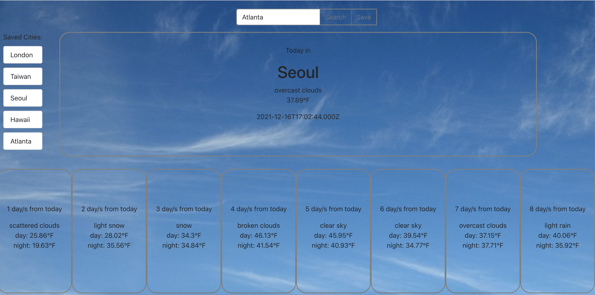

This application uses Openweathermap.org

Technologies/Frameworks: ReactJS, Redux Toolkit, Axios, Bootstrap

Features included:

- User can search a city to get it's current weather and weekly forecast
- User can also save their search in a saved city list
- The list items can be clicked and will fetch data to be displayed accordingly

