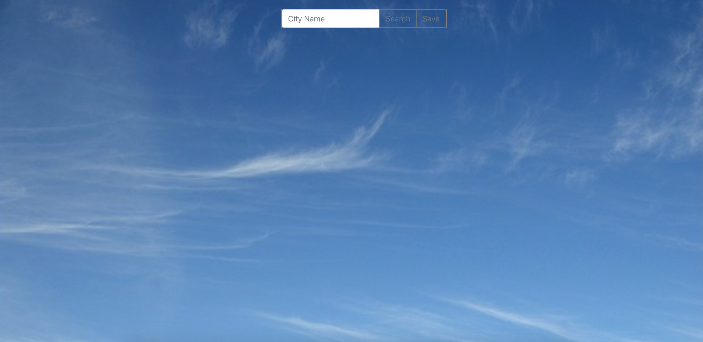
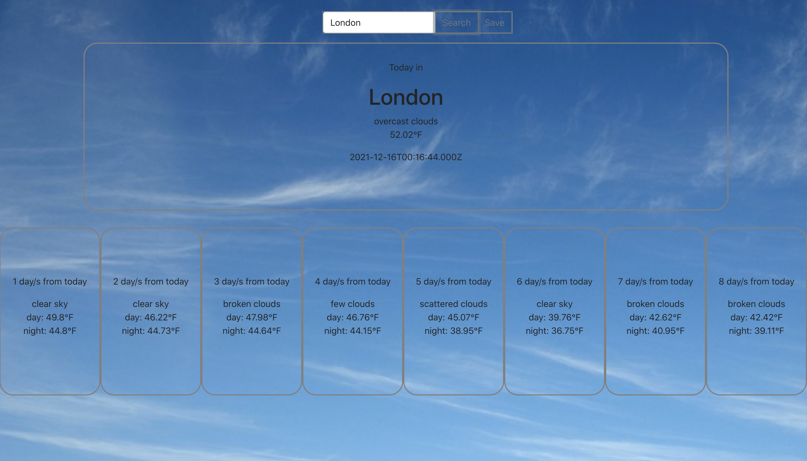
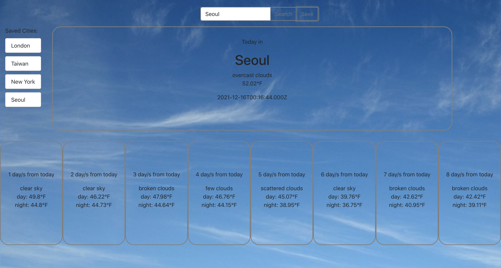

This application uses Openweatherapi.org

Technologies/Frameworks: ReactJS, Redux Toolkit, Axios, Bootstrap
Features included:

- User can search a city to get it's current weather and weekly forecast
- User can also save cities for quick reference

